<div align="center">



# GitGenie - AI-Powered Commit Messages

**Rub the lamp, get perfect commits ✨**

[](https://marketplace.visualstudio.com/items?itemName=mastersam.gitgenie)
[](https://marketplace.visualstudio.com/items?itemName=mastersam.gitgenie)
[](https://marketplace.visualstudio.com/items?itemName=mastersam.gitgenie)
[](https://github.com/mastersam07/gitgenie/actions)
[](LICENSE)

Generate meaningful commit messages that actually explain what your code does, powered by Google's Gemini AI.

</div>

## ✨ Features

### Core Features
- **🪄 One-Click Generation** - Click the magic wand icon in Source Control for instant commit messages
- **🤖 Smart Commit Messages** - Understands your code changes, not just file names
- **📝 Multiple Styles** - Choose from brief, standard, or detailed messages
- **🎯 Conventional Commits** - Automatically follows conventional commit format
- **⌨️ Multiple Access Methods** - Icon button, keyboard shortcut, or command palette
- **💡 Explanation Mode** - Learn why the message was generated
- **📊 Confidence Scoring** - Know when to review carefully
- **🎨 Context Aware** - Detects frameworks, languages, and patterns

### What Makes GitGenie Different
- **Actually understands code changes** - Not just "Updated file.js"
- **Learns from your commit style** - Analyzes your recent commits
- **Educational** - Shows reasoning behind each suggestion
- **Zero config** - Works out of the box (just add API key)

## 🚀 Installation

### From VS Code Marketplace (Recommended)

1. Open VS Code
2. Press `Ctrl+Shift+X` (or `Cmd+Shift+X` on Mac) to open Extensions
3. Search for "GitGenie"
4. Click Install

Or install via command line:
```bash
code --install-extension mastersam.gitgenie
```

### From VSIX (Manual Installation)
1. Download the `.vsix` file from [releases](https://github.com/mastersam07/gitgenie/releases)
2. In VS Code: `Extensions` → `...` → `Install from VSIX`
3. Select the downloaded file

## 🔧 Setup

1. **Get a Gemini API Key**
   - Go to [Google AI Studio](https://makersuite.google.com/app/apikey)
   - Create a new API key (it's free!)
   
2. **Configure GitGenie**
   - Open VS Code Settings (`Cmd/Ctrl + ,`)
   - Search for "GitGenie"
   - Paste your API key

3. **Start Using** (3 ways to generate commit messages)
   - **Click the 🪄 magic wand icon** in the Source Control panel toolbar
   - **Keyboard shortcut**: Press `Ctrl+Shift+G` (Windows/Linux) or `Cmd+Shift+G` (Mac)
   - **Command Palette**: `Ctrl+Shift+P` → "GitGenie: Generate Commit Message"

## 📖 Usage

### Basic Generation (3 Methods)

**Method 1: Icon Button (Recommended)**
```
1. Make your code changes
2. Stage files (git add)
3. Open Source Control panel (Ctrl+Shift+G on Windows/Linux, Cmd+Shift+G on Mac)
4. Click the 🪄 magic wand icon in the toolbar
5. Pick from 3 AI-generated suggestions
6. Message is applied to commit box
```

**Method 2: Keyboard Shortcut**
```
1. Stage your changes
2. Press Ctrl+Shift+G (or Cmd+Shift+G on Mac)
3. Select your preferred message
```

**Method 3: Command Palette**
```
1. Press Ctrl+Shift+P (Cmd+Shift+P on Mac)
2. Type "GitGenie: Generate Commit Message"
3. Press Enter
```

### With Explanation
```
1. Open Command Palette (Ctrl+Shift+P)
2. Run "GitGenie: Generate with Explanation"
3. See WHY each message was suggested
4. Learn to write better commits
```

## ⚙️ Configuration

| Setting | Description | Default |
|---------|-------------|---------|
| `geminiApiKey` | Your Gemini API key | - |
| `model` | Gemini model (`gemini-1.5-flash` or `gemini-1.5-pro`) | `gemini-1.5-flash` |
| `conventionalCommits` | Use conventional commit format | `true` |
| `includeEmoji` | Add emoji to commits | `false` |
| `messageStyle` | Default style (brief/standard/detailed) | `standard` |

## 🎯 Examples

### Before GitGenie
```
- "Updated files"
- "Fixed bug"  
- "Changes"
```

### After GitGenie
```
- "fix: handle null response in payment validation"
- "feat: add retry logic for failed Lightning Network payments"
- "refactor: extract webhook handler to separate module for better testability"
```

### With Explanation
```
Message: "fix: prevent race condition in order status updates"
Reasoning: "The diff shows adding a mutex lock around the order status 
update logic, which prevents multiple concurrent updates from causing 
inconsistent state. This is a bug fix for a concurrency issue."
Confidence: 92%
```

## 🤝 Contributing

Contributions welcome! This is an open-source project.

1. Fork the repository
2. Create your feature branch
3. Make your changes
4. Submit a pull request

## 📄 License

MIT License - See LICENSE file for details

## 🙏 Credits

Built with:
- Google Gemini AI
- Simple Git
- VS Code Extension API

## 🐛 Known Issues

- First generation might be slow (model initialization)
- Large diffs (>8000 chars) are truncated
- Requires internet connection

## 📮 Support

- [Report Issues](https://github.com/mastersam07/gitgenie/issues)
- [Feature Requests](https://github.com/mastersam07/gitgenie/discussions)

---